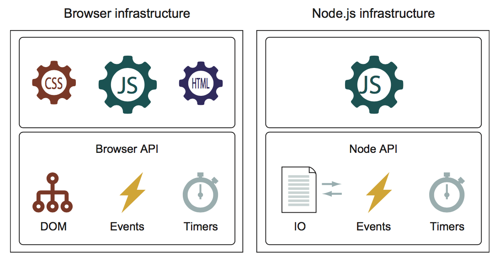

<a name="javascript-is-everywhere"></a>
## 1. 자바스크립트는 어디에나 있다

> 이번 장에서 다루어질 내용은
> - 자바스크립트 언어의 핵심 기능
> - 자바스크립트 엔진의 핵심 품목
> - 자바스크립트 개발의 세가지 관행

  Bob의 이야기로 시작해보겠습니다. C++를 이용해서 데스크탑 응용프로그램을 어떻게 개발하는지를 수년간 공부한 후에, 그는 2000년대 초반에 소프트웨어 개발자로 졸업을 하고 사회에 나왔습니다. 그 당시, 웹은 막 번성기를 맞이하고 있었고, 누구나 다 다음의 Amazon이 되고 싶어했습니다. 그래서 그는 먼저 웹 개발을 배웠습니다.
  <br />
  그는 form 인증이나 심지어 동적인 페이지 시계들과 같은 복잡한 기능을 구현하기 위해 자바스크립트로 뿌려진 웹 페이지들을 동적으로 생성할 수 있도록 PHP를 공부했습니다. 2년이라는 시간이 흐르고, 스마트폰이 거대한 시장을 생성하는 트렌드가 되었습니다. Bob은 iOS와 Android에서 실행되는 앱을 만들기 위해 Object-C와 Java를 공부했습니다.
  <br />
  수년 동안 Bob은 유지 보수 및 확장을 해야하는 많은 성공적인 응용프로그램을 개발했습니다. 하지만 불행히도, 매일같이 다 다른언어와 프레임워크 사이를 오가면서 Bob은 지쳐갔습니다.
  <br />
  이번에는 Ann에 대해서 이야기 해보겠습니다. 2년전, Ann은 웹과 cloud 기반의 응용프로그램을 주전공으로 소프트웨어 개발 학위를 받았습니다. 그녀는 iOS와 Android에서도 작동하는 모바일 응용프로그램과 더불어, 최근의 Model-view-controller 프레임워크를 기반으로 한 몇몇의 그다지 크지 않은 크기의 애플리케이션을 개발하였습니다. 그녀는 리눅스, 윈도우즈, OSX에서 작동하는 데스트탑 애플리케이션을 만들었고, 심지어 그 애플리케이션들을 전체적으로 cloud 기반으로한 서버리스 버전을 만들기 시작했습니다. *그리고 그 모든 것들이 자바스크립트로 이루어졌습니다.*
  <br />
  그것은 정말 대단한 것입니다! Bob이 10년동안 5가지의 개발 언어로 한 것을, Ann은 2년만에 *오직 자바스크립트만으로* 해낸 것입니다. 컴퓨터 역사상 특정 지식이 수많은 도메인에 쉽게 적용되고 유용했던 적은 드물었습니다.
  <br />
  1995년, 자그마한 열흘짜리 프르젝트가 이제는 세상에서 가장 널리 사용되는 프로그래밍 언어가 되었습니다. 자바스크립트는 강력한 자바스크립트 엔진과 단순한 웹 페이지를 넘어서게 해준 Node, Apache Cordova, Ionic, Electron과 같은 프레임 워크의 도입으로 인해 말 그대로 *어디에서나* 볼 수 있습니다. 그리고, HTML과 마찬가지로 언어 자체가 최신 애플리케이션 개발에 더욱 적합한 자바스크립트를 만들기 위해 대량의 업그레이드가 진행 중입니다.
  <br />
  이 책에서는, 여러분이 자바스크립트에 대해 알아야할 모든 정보를 알려드릴 것입니다. 그리하여 Ann이나 Bob과 같이, 여러분은 green field이건 brown field이건 상관없이 모든 종류의 애플리케이션을 개발할 수 있을 것입니다.

---
체크포인트
- Babel과 Traceur를 알고 있습니까? 알고 있다면 그것들이 최근의 자바스크립트 개발자들에게 왜 중요합니까?
- 웹 애플리케이션이 사용하는 브라우저의 자바스크립트 API의 핵심 부분들은 무엇입니까?
---

<a name="understanding-the-javascript-language"></a>
### 1.1 자바스크립트 언어의 이해

  경력이 쌓일수록, Bob이나 Ann과 같은 많은 자바스크립트 개발자들은 그 언어를 구성하는 방대한 수의 요소들을 적극적으로 사용하고 있습니다. 그러나, 많은 경우에 있어서, 그러한 기술들이 기초 단계를 넘어서지 못하고 있을지도 모릅니다. C와 같은 문법을 사용하는 자바스크립트는 C와 유사한 다른 언어(예를 들면, C#이나 자바)와 표면적 유사성을 가지므로 친숙하다는 인상을 남기기 때문에 이러한 현상이 발생할 수 있다고 여겨집니다.
  <br />
  사람들은 종종 그들이 C#이나 자바를 알면, 자바스크립트가 어떻게 작동하는지도 잘 안하고 착각합니다. 다은 주요 언어들과 비교해보면, 자바스크립트는 상당히 함수 지향적입니다. 몇몇의 자바스크립트 개념들은 대부분의 다른 언어들과 근본적으로 다릅니다.
  <br />
  이 차이점들은 아래의 내용들을 포함합니다:
  - *최우선 객체*: 함수 -- 자바스크립트에서 함수는 다른 자바스크립트 객체들과 같이 다루어집니다. 이들은 리터럴을 통해 만들 수 있고 변수로 참조 되며 함수의 인수로도 전달 될 수 있고, 심지어 함수의 반환 값으로 사용 될 수도 있습니다. 3장에서 최우선 객체로써의 함수가 자바스크립트 코드에 가져다주는 훌륭한 이점들을 살펴볼 것입니다.
  - *함수 클로저* -- 함수 클로저 개념은 일반적으로 잘 이해하기가 쉽지 않습니다. 하지만 이는 근본적으로 자바스크립트에 있어서 함수가 얼마나 중요한지를 보여줍니다. 지금은 *함수가 자신 안에서 사용된 외부 변수를 능동적으로 유지(덮어쓰기)할 때 그 함수가 크로저* 라는 것을 아는 것으로 충분합니다. 5장에서 이에 대해 명확하게 다룰 것이므로 왜 클로저를 쓰는지 모른다고 해서 아직은 걱정할 필요 없습니다. 클로저뿐만 아니라 3장과 4장에서는 함수 자체의 수많은 특징들을, 그리고 5장에서는 식별자들의 범주에 대해서 살펴볼 것입니다.
  - *범주* -- 최근까지도, 자바스크립트는 (다름 C와 비슷한 어어들처럼)구간 변수라는 것이 없었습니다. 대신에, 전역 변수들과 함수 변수들에 의존해 왔습니다.
  - *프로토타입 기반의 객체 지향* -- 클래스 기반의 객채 지향을 사용하는 다른 주 언어들(C#, 자바나 Ruby)과는 달리, 자바스크립트는 프로토타입을 사용합니다. 종종 (자바같은) 클래스 기반의 언어에서 자바스크립트로 넘어온 개발자들은 자바처럼 자바스크립트를 사용하려고 합니다. 즉, 자바스크립트 문법을 이용하여 자바의 클래스 기반 코드를 짜려고 합니다. 그러고선, 몇 가지 이유에서 결과가 그들이 생각한 것과 달라놀라곤 합니다. 이것이 왜 프로토타입을 심층적으로 들여다 보려고 하는 이유입니다. 어떻게 프로토타입 기반의 객체 지향이 작동하고 어떻게 자바스크립트에서 실행되는지를 말입니다.

  자바스크립트는 객체와 프로토타입들, 함수와 클로저들간의 긴밀한 관계로 구성되어 있습니다. 이 개념들간의 관게를 이해하면 자바스크립트 코드가 웹 페이지, 데스크탑 앱, 모바일 앱, 서버등 어느곳에서 실행되던지 상관없이 어떠한 유형의 애플리케이션 개발에 대한 강력한 기반을 제공함으로써 자바스크립트 프로그래밍 능력이 크게 향상 될 것입니다.
  <br />
  이러한 기본적인 개념에 더해서, 다른 자바스크립트의 기능들도 더 좋고 실용적인 코드를 작성하는데 도움을 줄 것입니다. 이들 중 일부는 Bob과 같은 노련한 개발자가 자바나 C++와 같은 다른 언어에서 찾아볼 수 있는 기능입니다. 특히, 우리는 다음에 초점을 맞추고 있습니다:
  - *Generators* -- 요청에 의해 복수의 값을 생성하거나 요청간에 실행을 중지할 수 있는 함수
  - *Promises* -- 비동기식 코드에 더 나은 제어를 제공해 줌
  - *Proxies* -- 우리로 하여금 특정 객체에 대한 접근을 제어할 수 있게 해줌
  - *Advanced array methods* -- 배열을 보다 우수하게 다룰 수 있게 해줌
  - *Maps and sets* -- maps는 dictionary collections를 생성함, sets는 고유 아이템 집합을 다룰 때 용이함
  - *Regular expressions* -- 복잡한 코드 조각들을 명료하게 할 수 있음
  - *Modules* -- 코드를 비교적 작고 독립적인 조각으로 나누어 프로젝트를 관리하기 쉽게 만들 수 있음
  이러한 기본 사항을 깊이 이해하고 고급 언어 기능을 최대로 활요하면 코드를 상위 수준으로 향상시킬 수 있습니다. 이러한 개념과 기능을 함께 묶어 기술을 습득하면 모든 종류의 자바스크립트 애플리케이션을 손쉽게 만들 수 있습니다.

#### 1.1.1 자바스크립트는 어떻게 진화할 것인가?
  표준화를 담당하는 ECMAScript 위원회는 이제 막 자바스크립트의 ES7/ES2016 버전을 끝냈다. ES7은 자바스크립트에 있어서(최소한 ES6에 비교했을 때) 상대적으로 작은 업그레이드이다, 왜냐하면 위원회의 목표는 언어데 대해 작고, 매년 증가하는 변화에 집중하는 것이기 때문입니다.
  <br />
  이 책에서 우리는 ES6뿐만 아니라 비동기식 코드를 다루는데 도움이 될 새로운 비동기 함수와 같은 ES7 기능들도 살펴볼 것입니다.
  <br /><br />
  
  
  **NOTE**: ES6/ES2015 혹은 ES7/ES2016에 정의 되어있는 자바스크립트의 기능들을 다룰 때는, 이 아이콘이 브라우저에서 지원되는지 여부에 대한 링크와 함께 표시될 것입니다.
  <br /><br />
  언어 사양에 대한 매년 증가하는 업데이트는 대단히 좋은 소식입니다, 그러나 이것은 그 새로운 사양이 공개되고 웹 개발자들이 곧바로 이에 대한 접근권을 가지는 것을 의미하지는 않습니다. 자바스크립트 코드는 자바스크립트 엔진에 의해서 실행됩니다, 따라서 우리가 선호하는 자바스크립트 엔진들이 이러한 새롭고 기대되는 기능들과 잘 작동할 수 있도록 업데이틑 되기까지 기다려야합니다.
  <br />
  불행히도, 자바스크립트 엔진 개발자들이 항상 최선의 노력을 다하지만, 당신이 너무 사용하고 싶어하는 기능이 아직은 지원되지 않을 가능성이 언제나 있습니다.
  <br />
  다행히, 여러분은 이 리스트들을 통해서 다양한 브라우저의 기능 지원 상태를 확인할 수 있습니다: [https://kangax.github.io/compat-table/es6/](https://kangax.github.io/compat-table/es6/), [http://kangax.github.io/compat-table/es2016plus/](http://kangax.github.io/compat-table/es2016plus/), and [https://kangax.github.io/compat-table/esnext/](https://kangax.github.io/compat-table/esnext/).

#### 1.1.2 트렌스파일러를 이용한 미지원 자바스크립트 접근
  브라우저의 빠른 배포 주기때문에 우리는 자바스크립트 기능이 지원되기까지 오래 기다리지 않아도 됩니다. 하지만 우리가 최신 자바스크립트 기능의 모든 이점을 활용하고 싶지만 까다로운 현실적인 문제로 그러지 못하게 되면 어떻게 될까요? 우리의 웹 애플리케이션 사용자들은 여전히 이전 브라우저를 사용할 수도 있지 않을까요?
  <br />
  이 문제에 대한 한가지 대답은 최신 자바스크립트 코드를 대부분의 현재 브라우저들에서 제대로 작동하는 코드로 변환시켜주는 툴인 트렌스파일러(transforation + complier)를 이용하라는 것입니다.
  <br />
  오늘날의 가장 인기있는 트렌스파일러들은 [Traceur](https://github.com/google/traceur-compiler)와 [Babel](https://.babeljs.io/)입니다. 이들을 설정하는것은 쉽습니다. [https://github.com/google/traceur-compiler/wiki/Getting-Started](https://github.com/google/traceur-compiler/wiki/Getting-Started)나 [http://babeljs.io/docs/setup/](http://babeljs.io/docs/setup/) 같은 튜토리얼을 따라하면 됩니다.
  <br />
  이 책에서는, 특별히 브라우저에서 자바스크립트 코드를 실행하는데 집중할 것입니다. 브라우저 플랫폼을 효과적으로 사용하려면 브라우저 내부의 동작을 연구해야합니다.

<a name="understanding-the-browser"></a>
### 1.2 브라우저의 이해
  오늘날, 자바스크립트 애플리케이션들은 다양한 환경에서 실행될 수 있습니다. 하지만 그 모든 것이 시작하고, 다른 모든 환경들이 아이디어를 얻은, 우리가 집중할 환경은 바로 *브라우저* 입니다. 브라우저는 우리가 볼 다양한 개념과 API들을 제공합니다.
  
  <caption>그림 1.1 클라이언트 웹 애플리케이션은 브라우저가 제공하는 기반시설에 의존합니다. 우리는 특별히 DOM, 이벤트, 타이머 그리고 브라우저 API에 집중할 것입니다.</caption>
  <br /><br />

  우리는 아래의 내용들에 집중할 것입니다:
  - *The Document Object Model(DOM)* -- DOM은 처음에 웹 애플리케이션의 HTML 코드에서 만들어진 클라이언트 웹 애플리케이션 UI의 구조화 된 표현입니다. 좋은 애플리케이션을 개발하기 위해서는 여러분은 자바스크립트의 핵심 기술에 대한 깊은 이해뿐만 아니라 DOM이 어떻게 구성되고 어떻게 그 DOM을 조종하는 효율적인 코드를 작성하는지도 알아야합니다. 이렇게 하면 고급 동적 UI를 손쉽게 만들 수 있습니다.
  - *이벤트* -- 상당수의 자바스크립트 애플리케이션은 이벤트에 의한 애플리케이션입니다. 이는 대부분의 코드는 특정 이벤트에 대한 응답에서 실행됨을 의미합니다. 네트워크 이벤트, 타이머, 그리고 클릭, 마우스 움직임, 키보드등과 같은 사용자에 의한 이벤트들이 이에 속합니다. 따라서, 우리는 13장에서 이 이벤트가 실질적으로 어떻게 작동하는지를 알아볼 것입니다. 우리는 종종 수수께끼 같지만 장기적인 실행 계산 및 부드러운 애니메이션과 같은 복잡한 코딩작업을 처리하는 타이머에 특별한 주의를 기울일 것입니다.
  - *브라우저 API* -- 우리가 세상과 상호작용하는 것을 돕기 위해, 브라우저는 장치, 지역적으로 저장된 데이터, 원격 서버와의 통신과 같은 정보에 대한 접근을 허용해주는 API를 제공합니다.

  자바스크립트 프로그래밍 기술를 완벽히 하고 브라우저가 제공하는 API에 대한 깊은 이해를 하면 여러분은 훨씬 나아질 것입니다. 하지만 나중에는 브라우저를 먼저 실행하고 다양한 문제와 불일치성에 직면할 것입니다. 완벽하다는 가정하에서는, 모든 브라우저는 오류도 없고 일관적인 방법으로 웹 표준을 지원해야합니다, 하지말 불행히도, 우리는 그런 완변한 세상에 있지 않습니다.
  <br />
  브라우저는 근간에 질적으로 매우 성장하였습니다. 그러나 아직도 우리가 대응해야만 하는 오류들과, API의 결핍과 각 브라우저만의 특성을 가지고 있습니다. 이러한 브라우저 문제를 해결하기 위한 포괄적인 전략을 개발하고 그 차이점과 특이점을 이해하는 것이 자바스크립트 자체의 숙달만큼 중요할 수 있습니다.
  <br />
  우리가 브라우저 애플리케이션이나 자바스크립트 라이브러리를 작성할 때, 그것이 사용될 브라우저를 선택하는 것은 중요한 고려사항입니다. 우리는 모든 브라우저를 지원하고 싶지만, 개발 및 테스트 자원에 대한 제한은 그럴 수 없게 합니다. 이러한 이유에서, 우리는 14장에서 크로스 브라우저 개발에 대한 전략을 살펴볼 것입니다.
  <br />
  효율적인 크로스 브라우저 코드를 개발하는 것은 개발자의 기술과 경험에 크게 의존할 수 있습니다. 이 책은 해당 기술 수준을 높이기 위한 것이프로, 최근의 모범 사례를 살펴볼 것입니다.

<a name="using-current-best-practices"></a>
### 1.3 모범 사례 응용
  자바스크립트 언어의 숙달과 크로스 브라우저 코딩 문제들에 대한 이해는 전문 웹 애플리케이션 개발자가 되기위한 중요한 부분이지만 그것이 다는 아닙니다. 빅리그에 참가하려면 이전 개발자들이 증명해온 점수들이 우수한 코드 개발에 도움이 된다는 특성을 보여줄 필요가 있습니다. 이러한 특성들은 *모범 사례* 로 알려져 있으며 언어 숙달 외에도 다음과 같은 요소들을 포함합니다.
  - 디버깅 기술
  - 테스팅
  - 성능 분석

  코딩할 때, 이러한 관행을 고수하는 것은 매우 중요하고, 우리는 책 전반에 걸쳐 이를 사용할 것입니다.

#### 1.3.1 디버깅
  자바스크립트 디버깅은 변수의 값을 확인하기 위해 `alert`를 사용하는 것이라고 여겨졌습니다. 다행히도, Firefox용 Firebug 개발자 확장 기능 덕분에 자바스크립트 코드를 디버그 하는 능력은 상당히 발전했습니다. 비슷한 도구들이 모든 주요 브라우저들에도 개발되었습니다:
  - *Firebug* -- 파이어폭스용 인기 개발자 확장 프로그램 ([http://getfirebug.com/](http://getfirebug.com/))
  - *크롬 개발자 도구* -- 크롬과 오페라에서 사용되는 크롬 팀에 의해 개발된 도구
  - *파이어폭스 개발자 도구* -- 파이어 폭스 팀이 만든 파이어 폭스에 내장되어 있는 도구
  - *F12 개발자 도구* -- 인터넷 익스플로러와 마이크로소프트 엣지에 내장되어 있는 도구
  - *웹킷 검사기* -- 사파리 도구

  여러분이 볼 수 있듯이, 모든 주요 브라우저들은 우리의 웹 애플리케이션을 디버깅 할 수 있는 개발자 도구를 제공합니다. 디버깅을 위해서 자바스크립트 경고를 쓰던 시대는 이제 끝났다!
  <br />
  이 모든 도구는 Firebug에서 주로 도입한 유사한 아이디어를 기반으로하므로 DOM 탐색, 자바스크립트 디버깅, CSS 스타일 편집, 네트워크 이벤트 추적등 비슷한 기능들을 제공합니다. 그들 중 어떤 것이라도 훌륭한 일을 할 것입니다. 그러니 선택한 브라우저에서 제공하는 것을 사용하거나 버그를 조사하는 브라우저에서 사용하십시오.
  <br />
  또한 크롬 개발자 도구와 같은 일부 프로그램을 사용하여 Node.js 앱과 같은 다른 프로그램을 디버깅 할 수 있습니다.

#### 1.3.2 테스팅
  이 책 전반에 걸쳐서, 예제 코드가 의도 한대로 작동하는지 확인하고 일반적인 코드 테스트 방법의 예제로 사용되도록 테스트 기술을 적용 할 것입니다. 테스팅에 사용할 주요 도구는 전제를 진실이나 거짓으로 주장하는 `assert` 함수입니다. 주장을 지정함으로써, 코드가 예상한대로 작동하는지를 확인할 수 있습니다.
  <br />
  이 함수의 일반적이 형식은 다음과 같습니다:

  ```js
  assert(condition, message);
  ```

  첫번째 매개변수는 참이어야하는 조건이고, 두번째 매개변수는 그렇지 않을 경우에 표시될 메시지입니다.
  <br />
  예로, 다음을 고려해보십시오:

  ```js
  assert(a === 1, "Disaster! a is not 1!");
  ```

  만약 변수 `a`의 값이 `1`이 아니면, 그 주장은 거짓이고, 메시지가 표시될 것입니다.

  **노트**: `assert` 함수는 언어의 표준 기능은 아닙니다.

#### 1.3.3 성능 분석
  또다른 중요한 사례는 성능 분석입니다. 자바 스크립트 엔진은 자바 스크립트의 성능에 놀라운 향상을 가져 왔지만 엉성하고 비효율적인 코드를 작성하는 것에는 변명의 여지가 없습니다.
  <br />
  책의 뒷부분에서는 성능 정보를 수집하기 위해 다음과 같은 코드를 사용할 것입니다:

  ```js
  console.time("My operation");

  for(var n = 0; n < maxCount; n++) {
    /* perform the operation to be measured */
  }

  console.timeEnd("My operation");
  ```

  우리는 내장 된 콘솔 객체의 `time`과 `timeEnd` 메소드에 대한 두 번의 호출로 측정 할 코드의 실행을 구분합니다.
  <br />
  작업이 실행되기 전에 `console.time`에 대한 호출은 이름을 가지고 타이머를 시작합니다 (이 경우에는 My operation). 그런 다음 `for` 루프에서 특정 횟수만큼 코드를 실행합니다 (이 경우 maxCount 횟수만큼). 코드의 단일 연산이 안정적으로 측정하기에는 너무 빨리 실행되기 때문에 측정 가능한 값을 얻기 위해 코드를 여러 번 수행해야합니다. 종종, 이 수는 측정되는 코드의 특성에 따라 수만 또는 수백만이 될 수 있습니다. 약간의 시행 착오를 통해 합리적인 가치를 선택할 수 있습니다.
  <br />
  작업이 끝나면 동일한 이름의 `console.timeEnd` 메서드를 호출합니다. 그러면 브라우저가 타이머가 시작된 이후 경과 한 시간을 출력합니다.
  <br />
  함께 배우게 될 다른 것들과 함께 이러한 모범 사례 기술은 여러분의 자바 스크립트 개발을 크게 향상시킬 것입니다. 브라우저가 제공하는 제한된 리소스와 점차 복잡해지는 브라우저의 기능 및 호환성에 결합하여 애플리케이션을 개발하기에는 강력하고 완벽한 기술의 집합이 필요합니다.

<a name="boosting-skill-transferability"></a>
### 1.4 기술 전달 능력 향상
  Bob이 웹 개발을 처음 배우게되었을 때 각 브라우저에는 스크립트와 UI 스타일을 해석하는 고유 한 방법이 있었으며 그 방법이 가장 좋은 방법이라고 주장하여 모든 개발자가 좌절감을 느끼게했습니다. 다행히도 HTML, CSS, DOM API 및 자바스크립트가 모두 표준화되어 브라우저 전쟁이 끝났으며 개발자는 효과적인 크로스 브라우저 자바스크립트 응용 프로그램으로 전환했습니다. 실제로 웹 사이트를 응용 프로그램으로 취급하는 데 초점을 두어 데스크탑 응용 프로그램에서 웹 응용 프로그램으로 넘어가는 많은 아이디어, 도구 및 기술을 이끌어 냈습니다. 이제 클라이언트 측 웹 개발에서 비롯된 아이디어, 도구 및 기술이 다른 응용 프로그램 도메인으로 침투하여 지식 및 도구 전송이 다시 발생했습니다.
  <br />
  핵심 API에 대한 지식을 바탕으로 기본적인 자바스크립트 원칙을 깊이있게 이해하면 더 다재다능한 개발자가 될 수 있습니다. 브라우저와 Node.js (브라우저에서 파생 된 환경)를 사용하여 상상할 수있는 거의 모든 유형의 애플리케이션을 개발할 수 있습니다:
  - *데스크탑 애플리케이션** -- NW.js([http://nwjs.io](http://nwjs.io/)) 혹은 Electron([http://electron.atom.io/](http://electron.atom.io/)). 이러한 기술은 대개 브라우저를 감싸서 표준 HTML, CSS 및 자바스크립트 (즉, 핵심 자바스크립트 및 브라우저 지식에 의존 할 수있는)로 데스크탑 UI를 구축하고 파일 시스템과 상호 작용할 수있는 추가 지원을 제공합니다. 윈도우즈, 맥 및 리눅스에서 동일한 모양과 느낌의 플랫폼 독립적인 데스크톱 애플리케이션을 만들 수 있습니다.
  - *모바일 애플리케이션* -- Apache Cordova([https://cordova.apache.org/](https://cordova.apache.org/)). 웹 기술로 구축 된 데스크톱 응용 프로그램과 마찬가지로 모바일 애플리케이션용 프레임워크는 래핑된 브라우저를 사용하지만 모바일 플랫폼과 상호 작용할 수있는 추가 플랫폼에 특성화된 API를 사용합니다.
  - *서버측 애플리케이션과 Node.js를 이용한 임베디드 장치용 애플리케이션* -- 브라우저와 동일한 기본 원칙을 많이 사용하는 브라우저에서 파생 된 환경입니다. 예를 들면, Node.js는 자바스크립트 코드를 실행하고 이벤트에 의존합니다.

  Ann은 그녀가 얼마나 운이 좋은지 알지 못합니다 (비록 Bob은 잘 알고 있습니다만). 표준 데스크톱 애플리케이션, 모바일 애플리케이션, 서버 측 애플리케이션 또는 임베디드 애플리케이션을 구축해야하는지 여부는 중요하지 않습니다. 이러한 모든 유형의 애플리케이션은 표준 클라이언트 측 웹 애플리케이션과 동일한 기본 원칙을 일부 공유합니다. 자바스크립트의 핵심 메커니즘이 어떻게 작동하는지 이해하고 브라우저에서 제공하는 핵심 API (예 : Node.js의 메커니즘과 공통점이 많은 이벤트)를 이해함으로써 개발 기술을 전면적으로 향상시킬 수 있습니다. 이 과정에서보다 다양한 개발자가되어 다양한 문제를 해결할 수있는 지식과 이해를 얻게됩니다. AWS Lambda와 같은 서비스에 자바스크립트 API를 사용하여 애플리케이션의 클라우드 구성 요소를 배포, 유지 관리 및 제어함으로써 클라우드 기반의 자체 서버리스 애플리케이션을 구축 할 수도 있습니다.

<a name="summary"></a>
### 1.5 요약
  - 클라이언트 웹 애플리케이션은 오늘날 가장 인기있는 기술 중 하나이며, 개발을 위해 한 번 사용 된 개념, 도구 및 기술은 다른 애플리케이션 영역으로 침투했습니다. 클라이언트 웹 애플리케이션의 기초를 이해하면 다양한 도메인의 애플리케이션을 개발하는 데 도움이됩니다.
  - 개발 기술을 향상 시키려면 브라우저에서 제공하는 인프라뿐만 아니라 자바스크립트의 핵심 메커니즘에 대해 깊이 이해해야합니다.
  - 이 책은 함수, 함수 클로저 및 프로토 타입과 같은 핵심 자바스크립트 메커니즘뿐만 아니라 generators, promises, proxies, map, set 및 modules와 같은 새로운 자바스크립트 기능에 중점을 두고 있습니다.
  - 자바스크립트는 수많은 환경에서 실행될 수 있지만 모든것이 시작되고 우리가 집중할 환경은 브라우저입니다.
  - 자바 스크립트 외에도 클라이언트 웹 애플리케이션은 이벤트 중심 애플리케이션이기 때문에 DOM (웹 페이지 UI의 구조화 된 표현) 및 이벤트와 같은 브라우저 내부를 탐색합니다.
  - 디버깅, 테스트 및 성능 분석과 같은 모범 사례를 토대로 이 탐색을 수행 할 것입니다.
