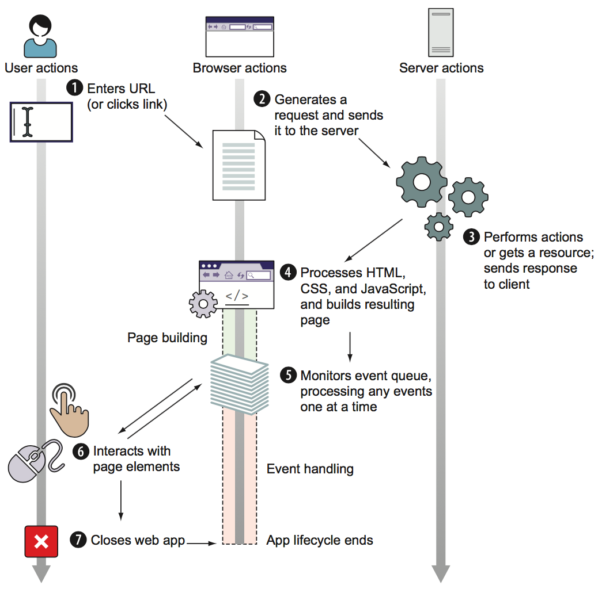
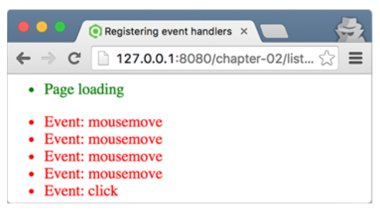
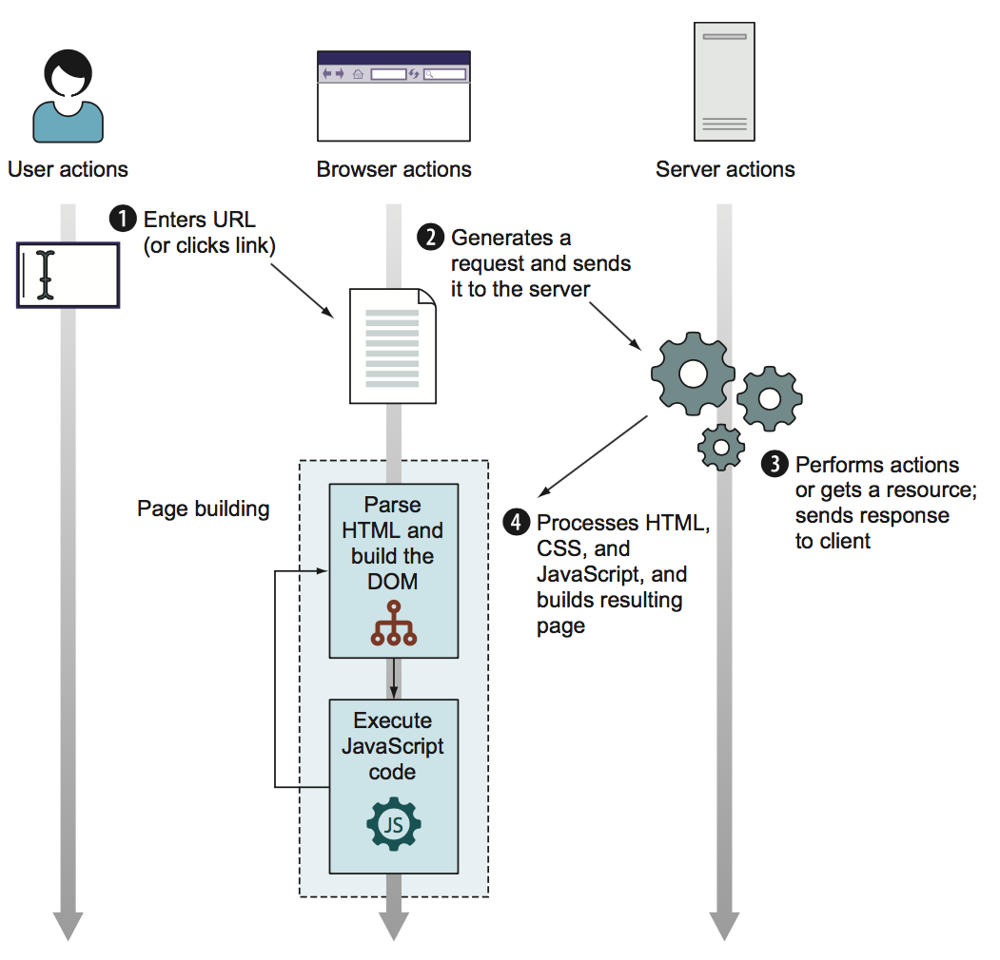
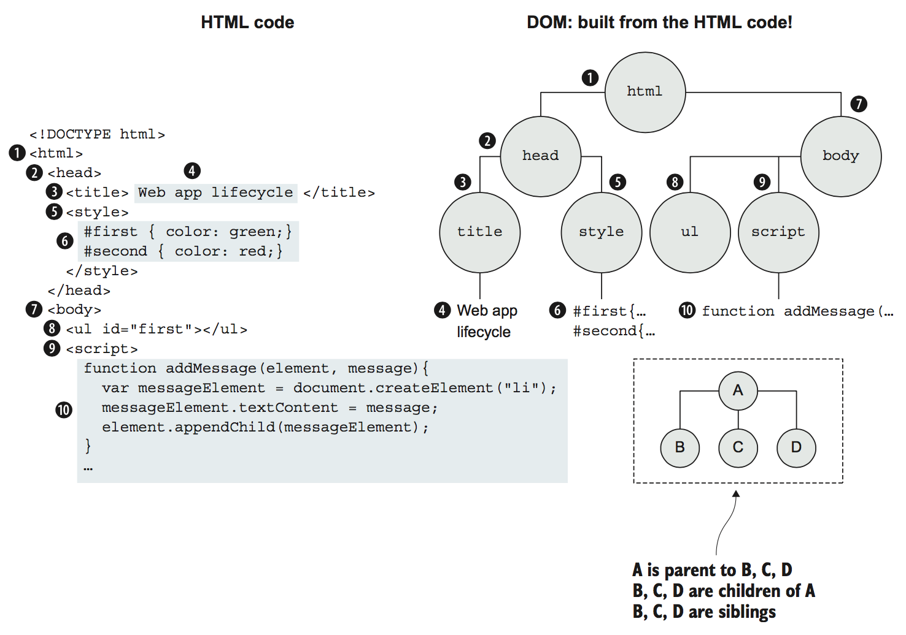
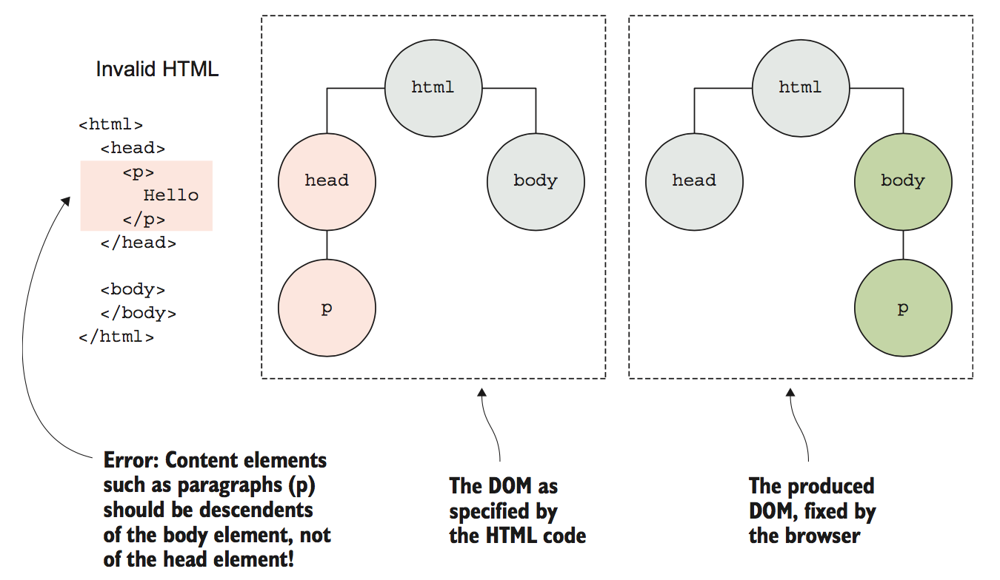

<a name="building-the-page-at-runtime"></a>
## 2. 실행 시간에 페이지 작성하기

> 이번 장에서 다루어질 내용은
> - 웹 애플리케이션의 라이프사이클 단계들
> - 웹 페이지를 만들기 위한 HTML 코드 처리
> - 자바크스립트 코드 실행 순서
> - 이베트를 통한 상호작용 생성
> - 이벤트 순환

  자바스크립트의 탐색은 클라이언트 웹 애플리케이션의 컨텍스트와 자바스크립트 코드가 실행되는 엔진인 브라우저에서 수행됩니다. 언어로써의 자바스크립트와 플랫폼으로써의 브라우저를 계속 탐색할 더 탄탄한 기반을 확보하기 위해서는 먼저 완전한 웹 애플리케이션의 라이프사이클, 특히 자바스크립트 코드가 어떻게 이 라이프사이클에 적용되는지를 이해해야만 합니다.
  <br />
  이번 장에서, 페이지가 요청되는 순간부터 사용자의 상호작용을 통하여 페이지가 닫히는 순간까지의 웹 애플리케이션 라이프 사이클을 알아볼 것 입니다. 우선, HTML 코드를 처리하여 어떻게 페이지가 만들어지는지 볼 것입니다. 그런 후에 페이지에 훨씬 더 많은 유동성을 부여하는 자바스크립트 코드의 실행에 촛점을 맞출 것입니다. 마지막으로 사용자의 행동에 반응하는 상호적인 애플리케이션을 개발하기 위해 어떻게 이벤트들이 다루어지는지를 보겠습니다.
  <br />
  이 과정에서, DOM(웹 페이지의 구조화된 표현식)이나 이벤트 순환(애플리케이션에서 어떻게 이벤트가 작동할지를 결정)과 같은 몇몇의 기본적인 웹 애플리케이션 개념들을 살펴보겠습니다.

---
체크포인트
- 브라우저는 항상 정확하게 주어진 HTML에 따라서 페이지를 생성합니까?
- 몇 개의 이벤트를 웹 애플리케이션은 한 번에 다룰 수 있습니까?
- 왜 브라우저는 이벤트들을 처리하기 위해서 이벤트 큐를 사용해야만 합니까?
---

<a name="the-lifecycle-overview">
### 2.1 라이프사이클 개요

  전형적인 클라이언트 웹 애플리케이션의 라이프사이클은 사용자가 브라우저의 주소창에 URL을 입력하거나 링크를 클릭함으로 시작합니다. 가령, 어떠한 용어를 찾아보기 위해 구글 홈페이지에 간다고 해보겠습니다. 아래의 그림 2.1의 왼쪽 위에 보여지듯이 www.google.com 이라는 URL을 입력할 것입니다.
  <br /><br />
  
  <caption>그림 2.1 클라이언트 웹 애플리케이션의 라이프사이클은 사용자가 웹사이트의 주소를 지정함으로 시작하고 사용자가 그 웹 페이지를 떠날 때 끝납니다. 이는 페이지 작성과 이벤트 처리의 두 단계로 이루어집니다.

  사용자를 대신하여, 브라우저는 요청을 처리하는(3) 서버에 전송 될 요청을 보내고(2), HTML, CSS, 그리고 자바스크립트 코드로 구성된 응답을 받습니다. 브라우저가 이 응답을 받는 순간에(4) 클라이언트 웹 애클리케이션이 진정으로 시작되는 것입니다.
  <br />
  클라이언트 웹 애플리케이션은 그래픽화된 사용자 인터페이스(GUI) 애플리케이션이기 때문에, 라이프사이클은 다른 GUI 애플리케이션들(표준의 데스크탑 애플리케이션이나 모바일 애플리케이션)과 비슷한 단계들을 따르고 다음의 두 단계를 수행합니다.

  1. *페이지 작성* -- 사용자 인터페이스를 설정합니다.
  2. *이벤트 처리* -- 이벤트 순환에 들어가서(5) 이벤트가 발생하기를 기다리고(6), 이벤트 처리기를 작동시킵니다.

  애플리케이션의 라이프사이클은 사용자가 웹 페이지를 닫거나 떠날 때 끝납니다(7).
  <br />
  이제 사용자가 마우스를 움직이거나 페이지를 클릭할 때마다 메시지를 출혁하는, 사용자의 행동에 반응하는 간단한 UI를 가진 웹 애플리케이션 예제를 살펴보겠습니다. 이번 장 전반에 걸쳐 이 애플리케이션을 사용할 것입니다.

  **리스트 2.1 이벤트에 반응하는 GUI를 가진 작은 웹 애플리케이션**
  ```html
  <!DOCTYPE html>
  <html>
    <head>
      <title>웹 앱 라이프사이클</title>
      <style>
        #first { color: green; }
        #second { color: red; }
      </style>
    </head>
    <body>
      <ul id="first"></ul>

      <script>
        /* 엘리먼트에 메시지를 추가하는 함수 정의 */
        function addMessage(element, message) {
          var messageElement = document.createElement("li");
          messageElement.textContent = message;
          element.appendChild(messageElement);
        }

        var first = document.getElementById("first");
        addMessage(first, "페이지 로딩중");
      </script>

      <ul id="second"></ul>

      <script>
        /* body에 mousemove 이벤트 처리기 추가 */
        document.body.addEventListener("mousemove", function() {
          var second = document.getElementById("second");
          addMessage(second, "이벤트: 마우스 움직임");
        });

        /* body에 클릭 이벤트 처리기 추가 */
        document.body.addEventListener("click", funciton() {
          var second = document.getElementById("second")
          addMessage(second, "이벤트: 클릭");
        });
      </script>
    </body>
  </html>
  ```

  리스트 2.1을 보면 이는 먼저 `first`와 `second`라는 id를 가진 엘리먼트들의 텍스트 색상을 지정하는 두개의 CSS 규칙을 정의하고 있습니다. 다름으로 `first` id를 가진 엘리먼트를 정의하ㅂ니다.

  ```html
  <ul id="fitst"></ul>
  ```

  다음으로, 새로운 리스트 엘리먼트를 생성하고 그것의 텍스트 내용을 설정하고 기존에 있는 엘리먼트에 덧붙이는 작업을 하는 `addMessage` 함수를 정의합니다:

  ```js
  function addMessage(element, message) {
    var messageElement = document.createElement("li");
    messageElement.textContent = message;
    element.appendChild(messageElement);
  }
  ```

  그런후에, `getElementById`라는 내장 메소드를 사용하여 문서에서 ID `first`를 가진 엘리먼트는 가져오고, 페이지가 로딩되고 있다는 것을 알려주는 메시지를 추가합니다.

  ```js
  var first = document.getElementById("first");
  addMessage(first, "페이지 로딩중");
  ```

  다음으로 웹 페이지의 `body`에 두 개의 이벤트를 붙여줍니다. 사용자가 마우스를 `addMessage` 함수를 호출하여 `second` 리스트 엘리먼트에 `"이벤트: 마우스 움직임"`이라는 메시지를 추가할 `mousemove` 이벤트 처리기부터 해보겠습니다:

  ```js
  document.body.addEventListener("mousemove", function() {
    var second = document.getElementById("second");
    addMessage(second, "이벤트: 마우스 움직임");
  })
  ```

  사용자가 페이지를 클릭할 때마다 `second` 리스트 엘리먼트에 "이벤트: 클리"이라는 메시지를 출력할 `click` 이벤트 처리기도 추가합니다.

  ```js
  document.body.addEventListener("click", function() {
    var second = document.getElementById("second");
    addMessage(second, "이벤트: 클릭");
  })
  ```

  이 애플리케이션의 실행 결과는 다음 그림 2.2에 보여지는 것과 같습니다.

  
  <caption>그림 2.2 리스트 2.1에서 작성된 코드를 실행하면, 사용자의 행동에 따라 메시지가 출력됩니다.

<a name="the-page-building-phase"></a>
### 2.2 페이지 작성 단계

  웹 애플리케이션이 작동하거나 심지어 보여지기 이전에, 그 페이지는 서버(보통 HTML, CSS, 그리고 자바스크립트 코드)로부터 받은 응답에 있는 정보를 가지고 구성이 먼저 되어야합니다. 이 페이지 작성 단계의 목표는 웹 애플리케이션의 UI를 설정하는 것인데, 이는 다음과 같은 두 단계로 이루어집니다.

  1. HTML을 분석하여 DOM을 생성하는 단계
  2. 자바스크립크 코드를 실행하는 단계

  1단계는 브라우저가 HTML 노드들을 처리할 때 행해지고, 2단계는 자바스크립트 코드를 가질 수 있는 `script` 엘리먼트라는 특별한 HTML 엘리먼트를 발견했을 때 실행됩니다. 이 페이지 작성 단계를 거치면서, 브라우저는 다음의 그림 2.3에 보여지는 것처럼 필요한 만큼 이 두 과정을 오가게 됩니다.

  
  <caption>그림 2.3 페이지 작성 단계는 브라우저가 그 페이지의 코드를 받을 때 시작합니다. HTML를 분석해서 DOM을 생성하는 과정과 자바스크립트를 실행하는 두 과정으로 행해집니다.</caption>

#### 2.2.1 HTML 분석과 DOM 생성

  페이지 작성 단계는 브라우저가 브라우저가 페이지의 UI를 작성하는 기본으로 사용되는 HTML 코드를 받음으로써 시작합니다. 브라우저는 이 작업을 HTML 코드를 한 번에 하나의 HTML 엘리먼트를 분석하고 노드로 표현되는 모든 HTML 페이지의 구조화된 표현인 DOM을 작성함으로써 수행합니다. 예를 들면, 그림 2.4는 첫번째 `script` 요소에 도달 할 때까지 작성된 예제 페이지의 DOM을 보여줍니다.
  
  <caption>그림 2.4 브라우저가 첫번째 `script` 엘리먼트를 발견했을 때, 이미 다수의 HTML 엘리먼트을로 DOM은 생성되어 있습니다.</caption>
  <br /><br />

  그림 2.4에서 첫번재 노드(1)를 제외한 각 노드가 정확히 하나의 부모를 가지도록 구성되어 있음을 알 수 있습니다. 가령, `head` 노드(2)는 부모로 `html` 노드(1)를 가지고 있습니다. 동시에, 노드는 몇 개든 상관없이 자식 노드를 가질 수 있습니다. 예를 들면, `html` 노드(1)는 `head` 노드 (2)와 `body` 노드(7) 이렇게 두 개의 자식 노드를 가지고 있습니다. 같은 엘리먼트의 자식노드들은 *형제* (`head` 노드(2)와 `body` 노드(7)는 형제입니다)라고 불립니다.
  <br />
  DOM이 HTML로 구성되어 HTML과 DOM리 밀접하게 연결되어 있지만, 그들은 동일하지는 않습니다. HTML 코드는 초기 DOM(페이지의 UI)을 구성할 때 브라우저가 따르는 *청사진* 으로 생각해야합니다. 브라우저는 유효한 DOM을 생성하기 위한 청사진으로 발견된 문제도 해결할 수 있습니다. 그림 2.5의 예를 살펴보겠습니다.

  
  <caption>그림 2.5 브라우저에 의해서 수정되는 유효하지 않은 HTML 예제</caption>
  <br /><br />

  그림 2.5는 단락 엘리먼트가 `head` 엘리먼트 안에 있는 잘못된 HTML 코드의 간단한 예를 보여줍니다. `head` 엘리먼트의 목적은 페이지 타이틀, 문자 인코딩, 외부 스타일이나 스크립트와 같은 전반적인 페이지 정보를 제공하는 것입니다. 예제처럼 페이지 콘텐츠를 정의하기 위한 것이 아닙니다. 이것은 오류이기 때문에 브라우저는 단락 엘리먼트를 페이지 콘텐츠가 있어야하는 `body` 엘리먼트에 배치함으로써 올바른 DOM(그림 2.5의 우측) 구성하여 자동으로 수정합니다.
  <br />
  페이지를 구성하는 동안, 브라우저는 자바스크립트 코드를 포함하는 `script`라는 특별한 종류의 HTML 엘리먼트를 발견할 수도 있습니다. 이 때, 브라우저는 HTML 코드를 가지고 DOM을 구성하는 작업을 멈추고 자바스크립트 코드를 실행합니다.
