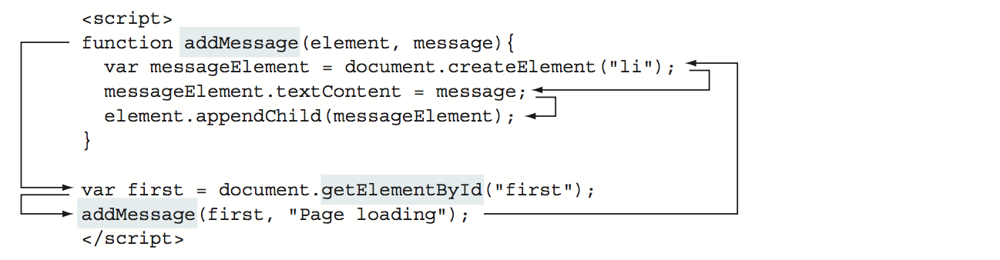
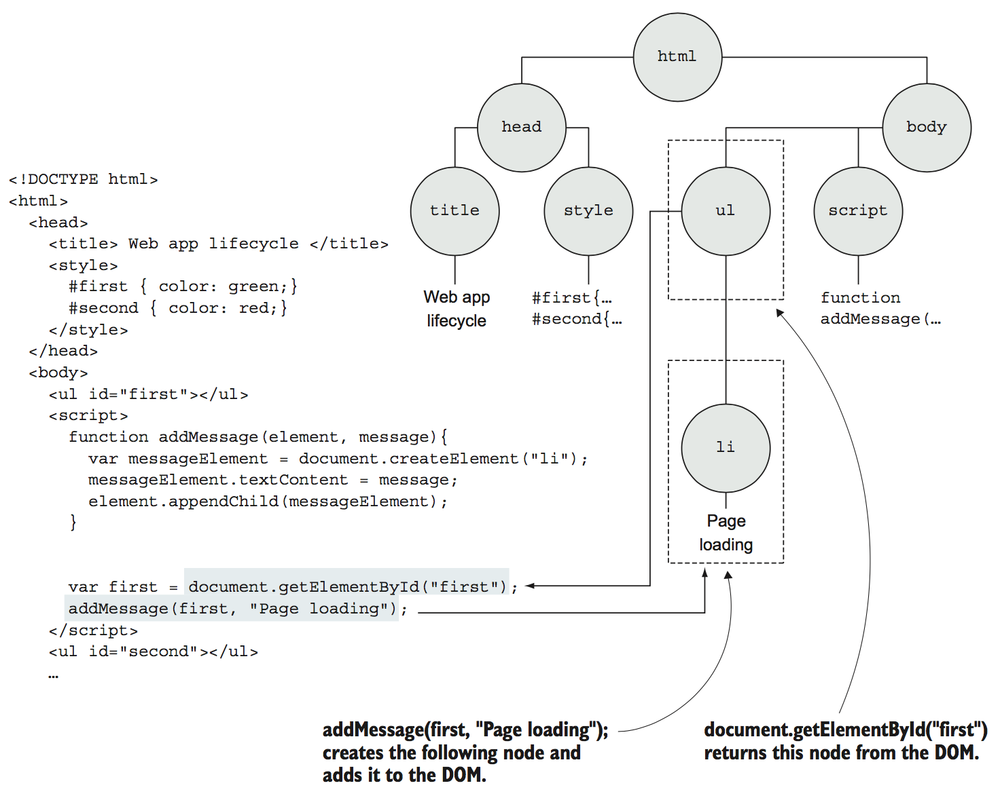

<a name="building-the-page-at-runtime"></a>
## 2. 실행 시간에 페이지 작성하기

> 이번 장에서 다루어질 내용은
> - 웹 애플리케이션의 라이프사이클 단계들
> - 웹 페이지를 만들기 위한 HTML 코드 처리
> - 자바크스립트 코드 실행 순서
> - 이베트를 통한 상호작용 생성
> - 이벤트 순환

  자바스크립트의 탐색은 클라이언트 웹 애플리케이션의 컨텍스트와 자바스크립트 코드가 실행되는 엔진인 브라우저에서 수행됩니다. 언어로써의 자바스크립트와 플랫폼으로써의 브라우저를 계속 탐색할 더 탄탄한 기반을 확보하기 위해서는 먼저 완전한 웹 애플리케이션의 라이프사이클, 특히 자바스크립트 코드가 어떻게 이 라이프사이클에 적용되는지를 이해해야만 합니다.
  <br />
  이번 장에서, 페이지가 요청되는 순간부터 사용자의 상호작용을 통하여 페이지가 닫히는 순간까지의 웹 애플리케이션 라이프 사이클을 알아볼 것 입니다. 우선, HTML 코드를 처리하여 어떻게 페이지가 만들어지는지 볼 것입니다. 그런 후에 페이지에 훨씬 더 많은 유동성을 부여하는 자바스크립트 코드의 실행에 촛점을 맞출 것입니다. 마지막으로 사용자의 행동에 반응하는 상호적인 애플리케이션을 개발하기 위해 어떻게 이벤트들이 다루어지는지를 보겠습니다.
  <br />
  이 과정에서, DOM(웹 페이지의 구조화된 표현식)이나 이벤트 순환(애플리케이션에서 어떻게 이벤트가 작동할지를 결정)과 같은 몇몇의 기본적인 웹 애플리케이션 개념들을 살펴보겠습니다.

---
체크포인트
- 브라우저는 항상 정확하게 주어진 HTML에 따라서 페이지를 생성합니까?
- 몇 개의 이벤트를 웹 애플리케이션은 한 번에 다룰 수 있습니까?
- 왜 브라우저는 이벤트들을 처리하기 위해서 이벤트 큐를 사용해야만 합니까?
---

<a name="the-lifecycle-overview">
### 2.1 라이프사이클 개요

  전형적인 클라이언트 웹 애플리케이션의 라이프사이클은 사용자가 브라우저의 주소창에 URL을 입력하거나 링크를 클릭함으로 시작합니다. 가령, 어떠한 용어를 찾아보기 위해 구글 홈페이지에 간다고 해보겠습니다. 아래의 그림 2.1의 왼쪽 위에 보여지듯이 www.google.com 이라는 URL을 입력할 것입니다.
  <br /><br />
  
  <caption>그림 2.1 클라이언트 웹 애플리케이션의 라이프사이클은 사용자가 웹사이트의 주소를 지정함으로 시작하고 사용자가 그 웹 페이지를 떠날 때 끝납니다. 이는 페이지 작성과 이벤트 처리의 두 단계로 이루어집니다.

  사용자를 대신하여, 브라우저는 요청을 처리하는(3) 서버에 전송 될 요청을 보내고(2), HTML, CSS, 그리고 자바스크립트 코드로 구성된 응답을 받습니다. 브라우저가 이 응답을 받는 순간에(4) 클라이언트 웹 애클리케이션이 진정으로 시작되는 것입니다.
  <br />
  클라이언트 웹 애플리케이션은 그래픽화된 사용자 인터페이스(GUI) 애플리케이션이기 때문에, 라이프사이클은 다른 GUI 애플리케이션들(표준의 데스크탑 애플리케이션이나 모바일 애플리케이션)과 비슷한 단계들을 따르고 다음의 두 단계를 수행합니다.

  1. *페이지 작성* -- 사용자 인터페이스를 설정합니다.
  2. *이벤트 처리* -- 이벤트 순환에 들어가서(5) 이벤트가 발생하기를 기다리고(6), 이벤트 처리기를 작동시킵니다.

  애플리케이션의 라이프사이클은 사용자가 웹 페이지를 닫거나 떠날 때 끝납니다(7).
  <br />
  이제 사용자가 마우스를 움직이거나 페이지를 클릭할 때마다 메시지를 출혁하는, 사용자의 행동에 반응하는 간단한 UI를 가진 웹 애플리케이션 예제를 살펴보겠습니다. 이번 장 전반에 걸쳐 이 애플리케이션을 사용할 것입니다.

  **리스트 2.1 이벤트에 반응하는 GUI를 가진 작은 웹 애플리케이션**
  ```html
  <!DOCTYPE html>
  <html>
    <head>
      <title>웹 앱 라이프사이클</title>
      <style>
        #first { color: green; }
        #second { color: red; }
      </style>
    </head>
    <body>
      <ul id="first"></ul>

      <script>
        /* 엘리먼트에 메시지를 추가하는 함수 정의 */
        function addMessage(element, message) {
          var messageElement = document.createElement("li");
          messageElement.textContent = message;
          element.appendChild(messageElement);
        }

        var first = document.getElementById("first");
        addMessage(first, "페이지 로딩중");
      </script>

      <ul id="second"></ul>

      <script>
        /* body에 mousemove 이벤트 처리기 추가 */
        document.body.addEventListener("mousemove", function() {
          var second = document.getElementById("second");
          addMessage(second, "이벤트: 마우스 움직임");
        });

        /* body에 클릭 이벤트 처리기 추가 */
        document.body.addEventListener("click", funciton() {
          var second = document.getElementById("second")
          addMessage(second, "이벤트: 클릭");
        });
      </script>
    </body>
  </html>
  ```

  리스트 2.1을 보면 이는 먼저 `first`와 `second`라는 id를 가진 엘리먼트들의 텍스트 색상을 지정하는 두개의 CSS 규칙을 정의하고 있습니다. 다름으로 `first` id를 가진 엘리먼트를 정의하ㅂ니다.

  ```html
  <ul id="fitst"></ul>
  ```

  다음으로, 새로운 리스트 엘리먼트를 생성하고 그것의 텍스트 내용을 설정하고 기존에 있는 엘리먼트에 덧붙이는 작업을 하는 `addMessage` 함수를 정의합니다:

  ```js
  function addMessage(element, message) {
    var messageElement = document.createElement("li");
    messageElement.textContent = message;
    element.appendChild(messageElement);
  }
  ```

  그런후에, `getElementById`라는 내장 메소드를 사용하여 문서에서 ID `first`를 가진 엘리먼트는 가져오고, 페이지가 로딩되고 있다는 것을 알려주는 메시지를 추가합니다.

  ```js
  var first = document.getElementById("first");
  addMessage(first, "페이지 로딩중");
  ```

  다음으로 웹 페이지의 `body`에 두 개의 이벤트를 붙여줍니다. 사용자가 마우스를 `addMessage` 함수를 호출하여 `second` 리스트 엘리먼트에 `"이벤트: 마우스 움직임"`이라는 메시지를 추가할 `mousemove` 이벤트 처리기부터 해보겠습니다:

  ```js
  document.body.addEventListener("mousemove", function() {
    var second = document.getElementById("second");
    addMessage(second, "이벤트: 마우스 움직임");
  })
  ```

  사용자가 페이지를 클릭할 때마다 `second` 리스트 엘리먼트에 "이벤트: 클리"이라는 메시지를 출력할 `click` 이벤트 처리기도 추가합니다.

  ```js
  document.body.addEventListener("click", function() {
    var second = document.getElementById("second");
    addMessage(second, "이벤트: 클릭");
  })
  ```

  이 애플리케이션의 실행 결과는 다음 그림 2.2에 보여지는 것과 같습니다.

  
  <caption>그림 2.2 리스트 2.1에서 작성된 코드를 실행하면, 사용자의 행동에 따라 메시지가 출력됩니다.

<a name="the-page-building-phase"></a>
### 2.2 페이지 작성 단계

  웹 애플리케이션이 작동하거나 심지어 보여지기 이전에, 그 페이지는 서버(보통 HTML, CSS, 그리고 자바스크립트 코드)로부터 받은 응답에 있는 정보를 가지고 구성이 먼저 되어야합니다. 이 페이지 작성 단계의 목표는 웹 애플리케이션의 UI를 설정하는 것인데, 이는 다음과 같은 두 단계로 이루어집니다.

  1. HTML을 분석하여 DOM을 생성하는 단계
  2. 자바스크립크 코드를 실행하는 단계

  1단계는 브라우저가 HTML 노드들을 처리할 때 행해지고, 2단계는 자바스크립트 코드를 가질 수 있는 `script` 엘리먼트라는 특별한 HTML 엘리먼트를 발견했을 때 실행됩니다. 이 페이지 작성 단계를 거치면서, 브라우저는 다음의 그림 2.3에 보여지는 것처럼 필요한 만큼 이 두 과정을 오가게 됩니다.

  
  <caption>그림 2.3 페이지 작성 단계는 브라우저가 그 페이지의 코드를 받을 때 시작합니다. HTML를 분석해서 DOM을 생성하는 과정과 자바스크립트를 실행하는 두 과정으로 행해집니다.</caption>

#### 2.2.1 HTML 분석과 DOM 생성

  페이지 작성 단계는 브라우저가 브라우저가 페이지의 UI를 작성하는 기본으로 사용되는 HTML 코드를 받음으로써 시작합니다. 브라우저는 이 작업을 HTML 코드를 한 번에 하나의 HTML 엘리먼트를 분석하고 노드로 표현되는 모든 HTML 페이지의 구조화된 표현인 DOM을 작성함으로써 수행합니다. 예를 들면, 그림 2.4는 첫번째 `script` 요소에 도달 할 때까지 작성된 예제 페이지의 DOM을 보여줍니다.
  
  <caption>그림 2.4 브라우저가 첫번째 `script` 엘리먼트를 발견했을 때, 이미 다수의 HTML 엘리먼트을로 DOM은 생성되어 있습니다.</caption>
  <br /><br />

  그림 2.4에서 첫번재 노드(1)를 제외한 각 노드가 정확히 하나의 부모를 가지도록 구성되어 있음을 알 수 있습니다. 가령, `head` 노드(2)는 부모로 `html` 노드(1)를 가지고 있습니다. 동시에, 노드는 몇 개든 상관없이 자식 노드를 가질 수 있습니다. 예를 들면, `html` 노드(1)는 `head` 노드 (2)와 `body` 노드(7) 이렇게 두 개의 자식 노드를 가지고 있습니다. 같은 엘리먼트의 자식노드들은 *형제* (`head` 노드(2)와 `body` 노드(7)는 형제입니다)라고 불립니다.
  <br />
  DOM이 HTML로 구성되어 HTML과 DOM리 밀접하게 연결되어 있지만, 그들은 동일하지는 않습니다. HTML 코드는 초기 DOM(페이지의 UI)을 구성할 때 브라우저가 따르는 *청사진* 으로 생각해야합니다. 브라우저는 유효한 DOM을 생성하기 위한 청사진으로 발견된 문제도 해결할 수 있습니다. 그림 2.5의 예를 살펴보겠습니다.

  
  <caption>그림 2.5 브라우저에 의해서 수정되는 유효하지 않은 HTML 예제</caption>
  <br /><br />

  그림 2.5는 단락 엘리먼트가 `head` 엘리먼트 안에 있는 잘못된 HTML 코드의 간단한 예를 보여줍니다. `head` 엘리먼트의 목적은 페이지 타이틀, 문자 인코딩, 외부 스타일이나 스크립트와 같은 전반적인 페이지 정보를 제공하는 것입니다. 예제처럼 페이지 콘텐츠를 정의하기 위한 것이 아닙니다. 이것은 오류이기 때문에 브라우저는 단락 엘리먼트를 페이지 콘텐츠가 있어야하는 `body` 엘리먼트에 배치함으로써 올바른 DOM(그림 2.5의 우측) 구성하여 자동으로 수정합니다.
  <br />
  페이지를 구성하는 동안, 브라우저는 자바스크립트 코드를 포함하는 `script`라는 특별한 종류의 HTML 엘리먼트를 발견할 수도 있습니다. 이 때, 브라우저는 HTML 코드를 가지고 DOM을 구성하는 작업을 멈추고 자바스크립트 코드를 실행합니다.

#### 2.2.2 자바스크립트 코드 실행

  `script` 엘리먼트 안에 포함된 모든 자바스크립트 코드는 파이어폭스의 Spidermonkey, 크롬과 오페라의 V8, 엣지나 IE의 Chakra와 같은 브라우저의 자바스크립트 엔진에 의해서 실행됩니다. 자바스크립트 코드의 주 목적이 페이지에 역동성을 주기 위함이므로, 브라우저는 상호작용하고 페이지를 수정하기 위한 자바스크립트 엔진에 의해 사용될 수 있도록 전역 객체를 통해 API를 제공합니다.

  **자바스크립트의 전역 객체**
  <br />
  브라우저가 자바스크립트 엔진에 제공하는 주요 전역 객체는 페이지가 담기는 윈도우를 나타내는 `window` 객체입니다. `window` 객체는 다른 모든 전역 객체, 전역 변수(심지어 사용자가 정의한 객체) 및 브라우저 API를 통해 접근할 수 있는 전역 객체입니다. 이 `window`라는 전역 객체의 가장 중요한 속성 중에 하나가 현재 페이지의 DOM를 나타내는 `document` 입니다. 이 객체를 이용함으로써, 자바스크립트 코드가 현재 있는 엘리먼트를 수정하거나 제거하고, 심지어 새로운 엘리먼트를 생성하여 삽입하는 등, 페이지의 DOM을 어떠한 순위로든 변경이 가능하게 합니다.
  <br />
  리스트 2.1의 한 부분을 살펴보겠습니다:

  ```js
  var first = document.getElementById("first");
  ```

  이 예제에서 `first`라는 ID를 가진 DOM 엘리먼트를 선택하여 `first`라는 변수에 그 값을 지정하기 위해 `document`라는 전역 객체를 이용하고 있습니다. 그런 후에, 자바스크립트 코드를 이용하여 그 엘리먼트에 내용을 변경하고, 속성을 수정하고, 유동적으로 새로운 자식노드들을 생성하고 추가하거나, 심지어 그 DOM에서 엘리먼트를 삭제하는등의 모든 종유를 수정을 가능하게 합니다.
  <br />
  브라우저에 의해 제공되는 전역 객체에 대한 이해를 가지고, 코드가 실행되는 시점을 정확하게 정의하는 두 가지 유형의 자바스크립트 코드를 살펴보겠습니다.

  **다른 유형의 자바스크립트 코드**
  <br />
  우리는 자바스크립트를 *전역 코드* 와 *함수 코드* 라는 두 가지 유형의 자바스크립트 코드로 광범위하게 구분합니다. 아래의 리스트를 가지고 이 두가지 유형의 코드를 이해해보도록 하겠습니다.

  **리스트 2.2 전역과 함수 자바스크립트 코드**
  ```html
  <script>
    /* 함수 코드는 함수 안에 담긴 코드를 말합니다. */
    function addMessage(element, message) {
      var messageElement = document.createElement("li");
      messageElement.textContent = message;
      element.appendChild(messageElement);
    }
    /* 전역 코드는 함수 밖에 있는 코드를 말합니다. */
    var first = document.getElementById("first");
    addMessage(first, "페이지 로딩중");
  </script>
  ```

  이 두가지 유형의 코드에 있어서 가장 큰 차이점은 그것들이 어디에 위치하느냐 입니다: 함수 안에 저의된 것을 *함수 코드* 라 하고, 그렇지 않고 함수 밖에 위치한 모든 함수들을 *전역 코드* 라고 명명합니다.
  <br />
  이 두가지 유형은 그것들의 실행에서도 차이점을 보입니다. 전역 코드는 한줄 한줄 순서대로 자바스크립트 엔진에 의해서 자동으로 실행됩니다. 리스트 2.2의 `addMessage` 함수를 정의하는 전역 코드의 한 부분에서 `first`라는 ID를 가진 엘리먼트를 가져와서 `addMessage` 함수를 호출하기 위해 `getElementById`라는 내장 메소드를 사용하고 있습니다. 그리고 이 과정은 그림 2.6에서 보여지는 것과 같이 한 번에 하나씩 수행됩니다.
  <br />
  반면에, 함수 코드는 실행되기 위해서 전역 코드(전역 코드에서 호출하는 `addMessage` 함수가 `addMessage`라는 함수 코드를 실행시킵니다)나 다른 함수, 또는 브라우저와 같이 다른 곳에서 호출이 되어야합니다.

  
  <caption>그림 2.6 자바스크립트 코드가 실행될 때의 프로그램 실행 순서</caption>
  <br /><br />

  **페이지 구축 단계에서 자바스크립트 코드 실행하기**
  <br />
  브라우저가 페이지 구축 단계에서 `script` 노드를 발견하면 HTML 코드에 의한 DOM 생성을 멈추고 대신에 자바스크립트 코드를 실행합니다.
  <br />
  이는 `script`엘리먼트 안에 포함된 자바스크립트의 전역 코드(또한, 전역 함수에 의해 호출되는 함수들)를 실행한다는 것을 의미합니다. 리스트 2.1을 다시 살펴보겠습니다.
  <br />
  그림 2.7은 자바스크립트의 전역 코드가 실행된 이후의 DOM 상태를 나타냅니다.

  
  <caption>그림 2.7 `script` 엘리먼트에 포함된 자바스크립트 코드의 실행 후 페이지의 DOM</caption>
  <br /><br/>

  실행 단계 별로 보겠습니다. 먼저 `addMessage`라는 함수가 정의됩니다:

  ```js
  function addMessage(element, message) {
    var meesageElement = document.createElement("li");
    messageElement.textContent = message;
    element.appendChild(messageElement);
  }
  ```

  그런 후에 `document`라는 전역 객체와 `getElementById`라는 그 객체의 메소드를 이용하여 DOM에서 엘리먼트를 추출합니다:

  ```js
  var first = document.getElementById("first");
  ```

  그 다음에 새로운 `li` 엘리먼트를 생성하고 콘텐츠를 수정하고 최종적으로 DOM에 그 엘리먼트는 삽입하는
 `addMessage` 함수가 호출됩니다.

  ```js
  addMessage(first, "페이지 로딩중");
  ```

  이 예제에서, 자바스크립트 코드는 새로운 엘리먼트를 생성하고 그것을 DOM에 삽입함으로써 현재의 DOM을 수정합니다. 일반적으로, 자바스크립트 코드는 새 노드를 만들고 기존 DOM 노드를 수정하거나 제거하는 등, DOM을 어느 정도 수정할 수 있습니다. 하지만, 아직 생성되지 않은 엘리먼트를 선택하고 수정하는 것과 같이 할 수 없는 일도 있습니다. 예를 들어, 우리는 `second`라는 ID를 가진 `ul` 엘리먼트를 선택하고 수정할 수 없습니다. 왜냐하면, 그 엘리먼트는 현재의 `script` 노드 후에 정의되어 있고 아직 그 엘리먼트까지 도달하여 생성되지 않았기 때문입니다. 그것이 개발자들이 `script` 엘리먼트를 페이지의 아래에 두는 한 이유입니다. 그리하면 특정한 HTML 엘리먼트에 도달했는지를 걱정할 필요가 없습니다.
  <br />
  일단 `script` 엘리먼트 안의 자바스크립트 코드 마지막 줄까지 자바스크립트 엔진이 실행하면, 브라우저는 자바스크립트 실행 모드를 끝내고 남은 HTML 코드를 처리하면서 DOM 노드의 생성을 이어갑니다. 그 과정에서, 브라우저가 또 다시 `script` 엘리먼트를 만나면, HTML 코드에서 DOM을 생성하던 작업을 또 멈추고, 자바스크립트 런타임이 자바스크립트 코드의 실행을 시작합니다. 이 때, 자바스크립트 애플리케이션의 전역 상태가 계속 유지된다는 것이 매우 중요합니다. 하나의 `script` 엘리먼트에서 자바스크립트 코드를 실행하는 동안 생성 된 모든 사용자 정의의 전역 변수는 일반적으로 다른 `script` 엘리먼트의 자바스크립트 코드에서 접근 할 수 있습니다. 이는 자바스크립트의 모든 전역 변수를 저장하는 `window` 객체가 페이지의 전체 수명주기 동안 살아있고 접근이 가능하기 때문입니다.
  
  1. HTML로부터 DOM을 생성
  2. 자바스크립트 코드 실행

  이 두 단계는 처리된 HTML과 실행될 자바스크립트 코드가 있는 한 반복됩니다.
  <br />
  최종적으로, 더이상 브라우저가 처리할 HTML 엘리먼드가 없을 때, 페이지 구축 단계는 끝납니다. 그러면 브라우저는 *이벤트 처리*라는 웹 애플리케이션의 두번째 부분으로 넘어갑니다.
